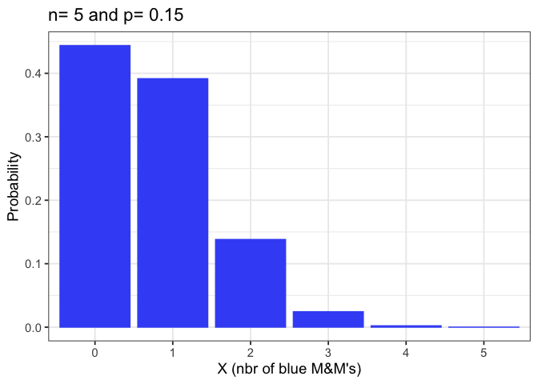
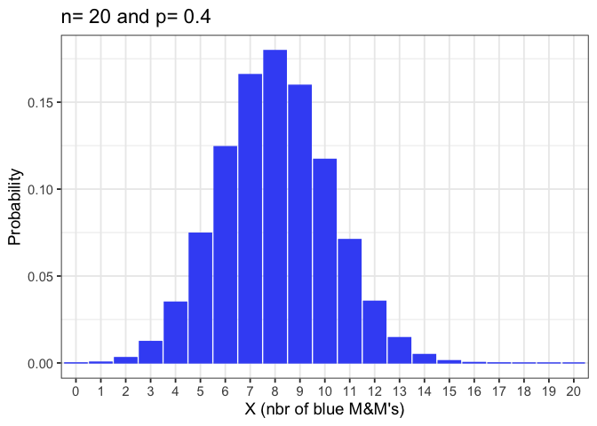

## Introduction

The following script is a wrapped custom function which calculate the
binomial distribution with parameters n and p and plot the discrete
probability distribution of the number of successes (xi) in a sequence
of n independent experiments, each asking a yes–no question, and each
with its own Boolean-valued outcome: success (with probability p) or
failure (with probability q = 1-p)

## Details of the experiment

Material:
- A 45g pack of a famous brand of color-varied sugar-coated
chocolate dragée.
- a cup

Experiment: Perform a sequence of 5 independent random draws of candies
in the 45g pack, with replacement. Answer each time the following yes–no
question: is the candy blue ?

Variable X: Number of successes (i.e. nbr of blue sweets) after 5 random
draws with replacement (xi={0,1,2,3,4,5})

## Packages

``` r
library(ggplot2)
```

    ## Warning: package 'ggplot2' was built under R version 4.2.3

## Custom function

``` r
make_my_MMs_plot <- function(n=5,p=0.15) {
  nbrB<-c(0:n)
  Cnx<-factorial(n)/(factorial(nbrB)*(factorial(n-nbrB)))
  probB<-NULL
  for(i in 1:(n+1)) {
    probB[i]<-Cnx[i]*p^nbrB[i]*(1-p)^(n-nbrB[i])
  }
  dataMMs<-data.frame(nbrB=factor(nbrB),
                      prob=probB)
  ggplot(dataMMs,aes(x=nbrB,
                     y=probB))+
    geom_bar(stat = "identity",
             col="#4058F5",
             fill="#4058F5")+
    ylab("Probability")+
    xlab("X (nbr of blue M&M's)")+
    ggtitle(paste("n=",n,"and p=",p))+
    theme_bw(base_size = 14)
}
```

## Plot

``` r
make_my_MMs_plot() # plot with default values: 5 draws and a probabiliyt of success of 0.15
```



``` r
make_my_MMs_plot(n=20,p=0.4) # plot for 20 draws and a probability of success of 0.4
```



